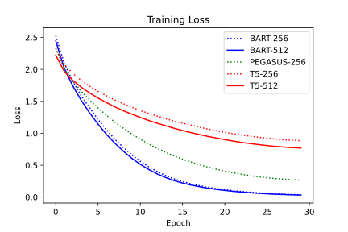
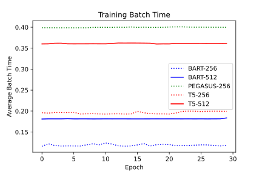
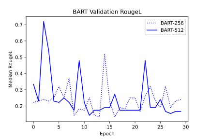
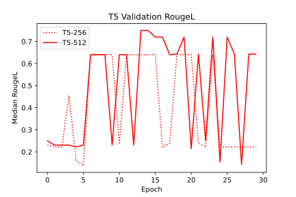
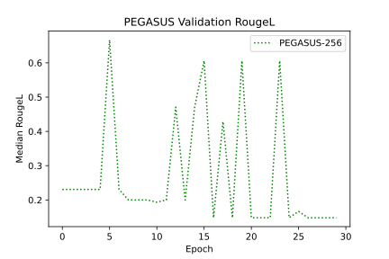
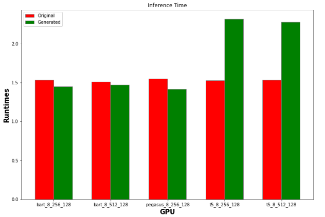
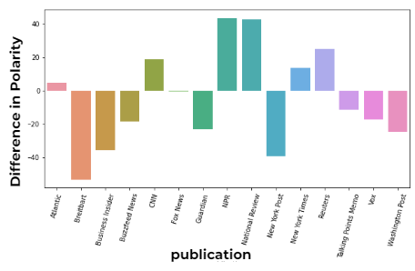
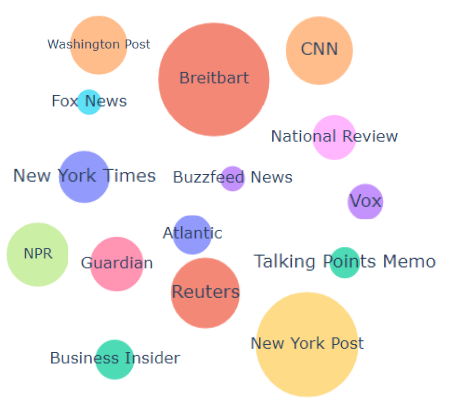
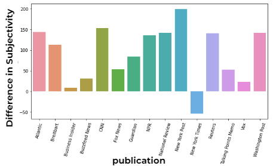
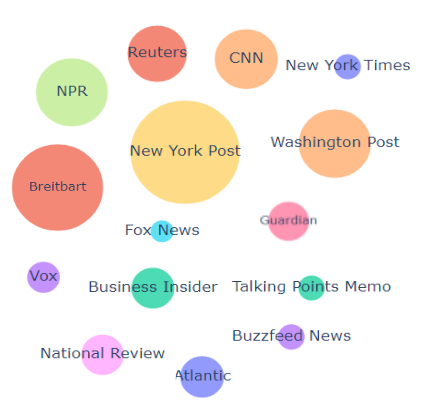

# Sensationalism and Gender Bias in News Headlines using Fine-tuned Summarization Models
A study of gender bias and sensationalism on summarization models fine-tuned for headline generation.

---

## Project Description

This project examines the relationship between a news article and its headline by understanding the importance of gender bias and sensational words. This build upon the article *When Women Make Headlines*[^1] where the authors compared the usage of sensational words in headlines about women to headlines about other topics. We extend their analysis by looking further into machine generated headlines and the articles themselves in order to understand potential biases in summarization models.

---

## Repository Structure

This table descibes the top-level repository structure.

| **Directory** | **Description** |
| --- | --- |
| `src/` | Contains source code for fine-tuning summarization models for headline generation, collecting and polarization data of headlines, and NYU HPC Greene SLURM jobs scripts. |
| `figures/` | Contains figures for slides and observations. |

This table describes the repository structure in the source code directory (i.e. `src/`).

| **Directory** | **Description** |
| --- | --- |
| `data/` | Contains dataset files. Additionally, has `preprocessing.py` which can be used to generate the train, validation, and test splits. See `data/README.md` for more details. |
| `out/` | Output directory for SLURM jobs (Not tracked on GitHub). |
| `summarization/` | Fine-tuning and headline generation scripts. |
| `sentiment_analysis/` | Sentiment scripts. |
| `jobs/` | NYU HPC Greene SLURM scripts. |
---

## Experimental Data

To access the experimental data such as the trained models and SLURM logs, visit the [Google Drive](https://drive.google.com/drive/folders/1_SHEAVvvQO5BBgFzADNr7L8VikgxN4J4) folder. Each folder is a specific experiment with the following files:

| **File Extension** | **Description** |
| --- | --- |
| `.params` | Hyperparameters for the model. Columns include: 'epochs', 'model', 'batch_size', 'learning_rate', 'article_max_len', 'headline_max_len', 'split', 'seed', and 'results_name'. |
| `.out` | SLURM stdout log. Files beginning with 'T' are for fine-tuning the summarization model and files beginning with 'E' are for collecting the generated headlines on the test dataset. |
| `.err` | SLURM stderr log. Files beginning with 'T' are for fine-tuning the summarization model and files beginning with 'E' are for collecting the generated headlines on the test dataset. |
| `.test` | CSV file of the same form as the test dataset generated in `src/data` with the following changes: renaming column 'content' to 'article', renaming column 'title' to 'headline', and new column 'generated_headline' from performing inference on 'article' using fine-tuned model. |
| `.pt` | Model weight for summarization model. |
| `.csv` | CSV file of training performance for fine-tuning summarization model. Columns include: 'rougeL', 'rouge1', 'rouge2', 'loss', 'epoch', and 'batch_time'. |

---

## Recreating Experiments

**Dependencies**

Available as `pip` and/or `conda` installations:

* `transformers`
* `datasets`
* `accelerator`
* `rouge-score`
* `pytorch`
* `numpy`
* `pandas`
* `nltk`
* `matplotlib`

NLTK and certain transformer models may require additional installations. Follow error outputs to install.

### Fine-tuning Summarization Models

1. Login to NYU HPC Greene, navigate to your `/scratch` directory, and clone this repository.
2. Install dependencies in a conda environment.
3. Download the dataset using the instructions in `src/data/README.md`.
4. Set working directory to `src/`. Edit the `jobs/summarization/train/runner.sh` file to load the conda environment from (2), and point to the correct path of the cloned repo's `src/` folder.
5. Run `./jobs/summarization/train/batch.sh` to enqueue the SLURM jobs.
6. Generated files will be located in `src/out/`.

### Collecting Generated Headlines

1. Download experimental data (specifically `.pt` and `.params` files) or run the previous fine-tuning steps. Make sure the files are located in `src/out`.
2. Install dependencies in a conda environment.
3. Set working directory to `src/`. Edit the `jobs/summarization/eval/runner.sh` file to load the conda environment from (2), and point to the correct path of the cloned repo's `src/` folder.
4. Run `./jobs/summarization/eval/batch.sh` to enqueue the SLURM jobs.
5. Generated files will be located in `src/out/`.

## Observations

### Summarization Observations

#### Training Loss

* Doubling input article size of BART models had a negligible effect on loss convergence.
* The models have a similar rate of convegence, but vary in the loss convergence value.

#### Training Batch Time

* Doubling input article size lead to a ~1.5x increase for BART and a ~1.8x increase for T5.
* PEGASUS is the slowest model to train, and the previous observation explains why the model did not train in time.

#### Validation Median RougeL

* Median RougeL is noisy which can potentially be partially attributed to the small batch size.
* Doubling input article size leads to higher and more consistent RougeL scores.

#### Sentiment Analysis Results

* Red bars signify inference time (in seconds) for the original headlines, while green bars are for the generated headlines.

* Polarity scores were calculated with the VADER sentiment analysis package.
* The bar chart y axis reflects the deviation between the actual headline polarity and the generated headline polarity. i.e. (actual_headline_polarity - generated_headline_polarity).
* Breitbart, Business Insider and the New York Post had the most polar headlines compared to the generated headlines.

* The bubble sizes above are proportional to the absolute value of the difference in polarity scores. i.e. abs(actual_headline_polarity - generated_headline_polarity).
* Breitbart, the New York Post and NPR had the highest difference in scores.

* Subjectivity scores were calculated with the TextBlob sentiment analysis package.
* The bar chart y axis reflects the deviation between the actual headline subjectivity and the generated headline subjectivity. i.e. (actual_headline_subjectivity - generated_headline_subjectivity).
* As the generated headlines try to summarise the article, while the original headlines might have more subjective keywords, most of the differences are positive, notably barring the New York Times

* The bubble sizes above are proportional to the absolute value of the difference in subjectivity scores. i.e. abs(actual_headline_subjectivity - generated_headline_subjectivity).
* Absolute value differences in the subjectivity scores were quite similar to the polarity scores

---

## References
[^1]: https://pudding.cool/2022/02/women-in-headlines/

1. https://github.com/cjhutto/vaderSentiment
2. https://github.com/sloria/TextBlob
3. https://www.kaggle.com/datasets/snapcrack/all-the-news
